# Spring PetClinic Microservices — Local Deployment

**DevOps Micro-Internship Final Project — Personal Local Deployment**
**Deployed by:** Sonny Enchill | **Date:** 17 June 2026

This repository documents two separate pieces of work:

- **May 2026 — Group deployment (EKS):** The team of 10 deployed the Spring PetClinic application to Amazon EKS using Terraform, GitHub Actions CI/CD, Amazon ECR, and an ALB ingress. That work lives in the team organisation at [spring-pet-clinic/spring-pet-clinic-deployment](https://github.com/spring-pet-clinic/spring-pet-clinic-deployment).

- **June 2026 — Personal local deployment (Docker Compose):** This repo. After the group sprint, this is an individual demonstration of the same application running end-to-end on a local machine using Docker Compose and Docker Desktop — no cloud infrastructure required.

This walkthrough covers the full local deployment process: cloning the repo, pulling and starting all 11 containers, verifying every service endpoint, testing the application, and confirming monitoring is live with real data.

---

## What Was Deployed

The Spring PetClinic application is a distributed microservices system made up of 11 containers running together:

| Container | Image | Port | Role |
|---|---|---|---|
| config-server | springcommunity/spring-petclinic-config-server | 8888 | Centralised configuration for all services |
| discovery-server | springcommunity/spring-petclinic-discovery-server | 8761 | Eureka service registry |
| api-gateway | springcommunity/spring-petclinic-api-gateway | 8080 | Frontend + request routing |
| customers-service | springcommunity/spring-petclinic-customers-service | 8081 | Owner and pet management |
| visits-service | springcommunity/spring-petclinic-visits-service | 8082 | Vet visit records |
| vets-service | springcommunity/spring-petclinic-vets-service | 8083 | Veterinarian data |
| genai-service | springcommunity/spring-petclinic-genai-service | 8084 | AI chatbot (Spring AI + OpenAI) |
| admin-server | springcommunity/spring-petclinic-admin-server | 9090 | Spring Boot Admin dashboard |
| tracing-server | openzipkin/zipkin | 9411 | Distributed tracing |
| prometheus-server | (built locally) | 9091 | Metrics collection |
| grafana-server | (built locally) | 3030 | Metrics dashboards |

Services start in dependency order enforced by Docker Compose health checks: `config-server` must be healthy before `discovery-server` starts; all domain services wait for both to be healthy.

---

## How to Run Locally

**Prerequisites:** Docker Desktop installed and running.

```bash
# 1. Clone the repository
git clone https://github.com/sqenchill/spring-petclinic-microservicespl.git
cd spring-petclinic-microservicespl

# 2. Start all services
docker compose up -d

# 3. Verify all containers are running
docker compose ps
```

Once all containers are up, access the services at:

| Service | URL |
|---|---|
| Application | http://localhost:8080 |
| Eureka Dashboard | http://localhost:8761 |
| Spring Boot Admin | http://localhost:9090 |
| Zipkin | http://localhost:9411 |
| Prometheus | http://localhost:9091 |
| Grafana | http://localhost:3030 |

To stop:
```bash
docker compose down
```

---

## Deployment Walkthrough with Evidence

### Step 1 — Clone the Repository

The repository was cloned locally and the directory structure confirmed, showing all 8 microservice modules alongside `docker-compose.yml`, `docker/`, and `scripts/`.

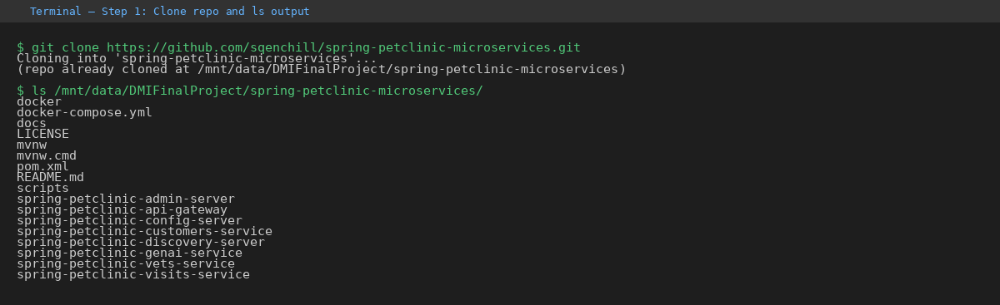

---

### Step 2 — Start All Services with Docker Compose

Running `docker compose up -d` pulled all pre-built images from Docker Hub (`springcommunity/*`) and built the local Prometheus and Grafana images. Containers started in the correct dependency order: `config-server` came up healthy first, then `discovery-server`, then all remaining services in parallel.

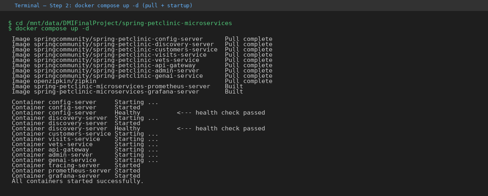

---

### Step 3 — Confirm All Containers Are Running

`docker compose ps` confirmed all 11 containers were up. `config-server`, `discovery-server`, and `tracing-server` showed `(healthy)` status from their configured health checks.

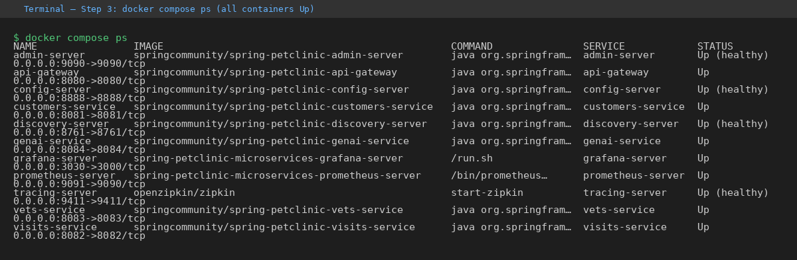

`docker ps` confirmed the same from the Docker daemon directly, with all containers up for 6 minutes and ports correctly mapped.

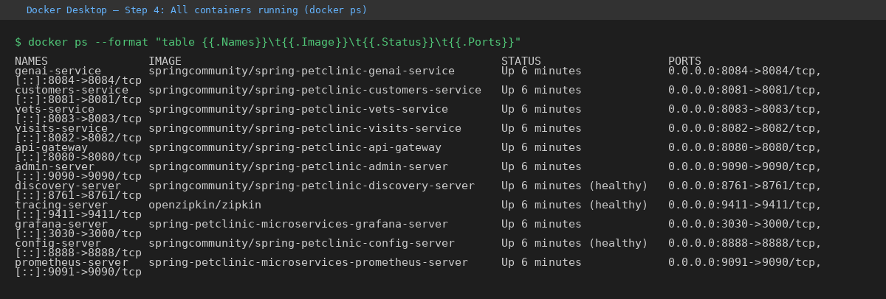

---

### Step 4 — Verify All Service Endpoints

**Application (http://localhost:8080)**

The PetClinic frontend loaded correctly, including the GenAI chat panel powered by the `genai-service`.

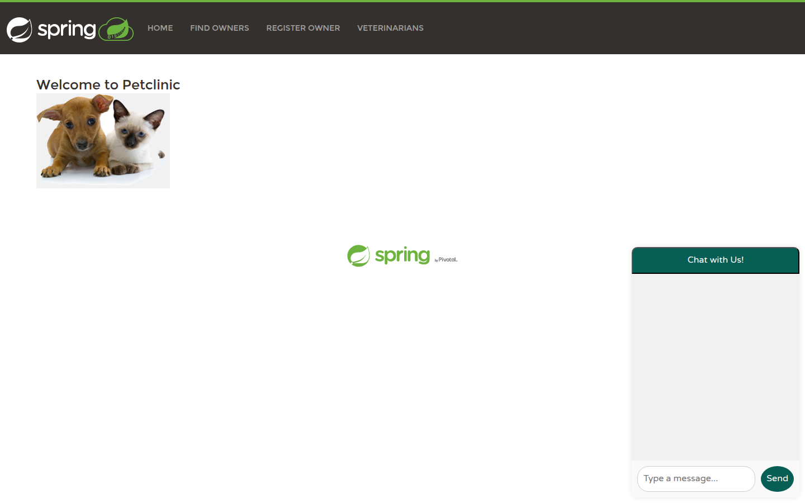

---

**Eureka Service Registry (http://localhost:8761)**

All 6 application services registered successfully with Eureka: `ADMIN-SERVER`, `API-GATEWAY`, `CUSTOMERS-SERVICE`, `GENAI-SERVICE`, `VETS-SERVICE`, `VISITS-SERVICE` — all showing status `UP`.

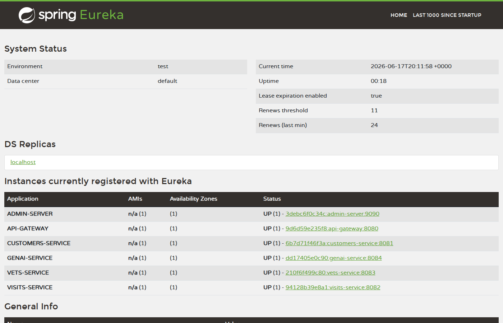

---

**Spring Boot Admin (http://localhost:9090)**

Spring Boot Admin reported **all up** with a green checkmark at 9:12 PM on 17 June 2026. All 6 applications (6 instances) were healthy and running version 3.4.1.

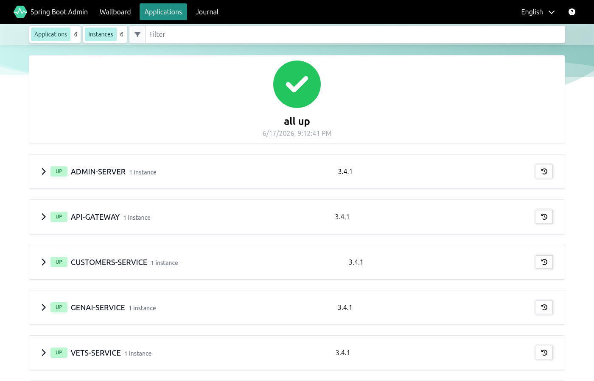

---

**Zipkin Tracing (http://localhost:9411)**

Zipkin was running and ready to collect distributed traces from all instrumented services.

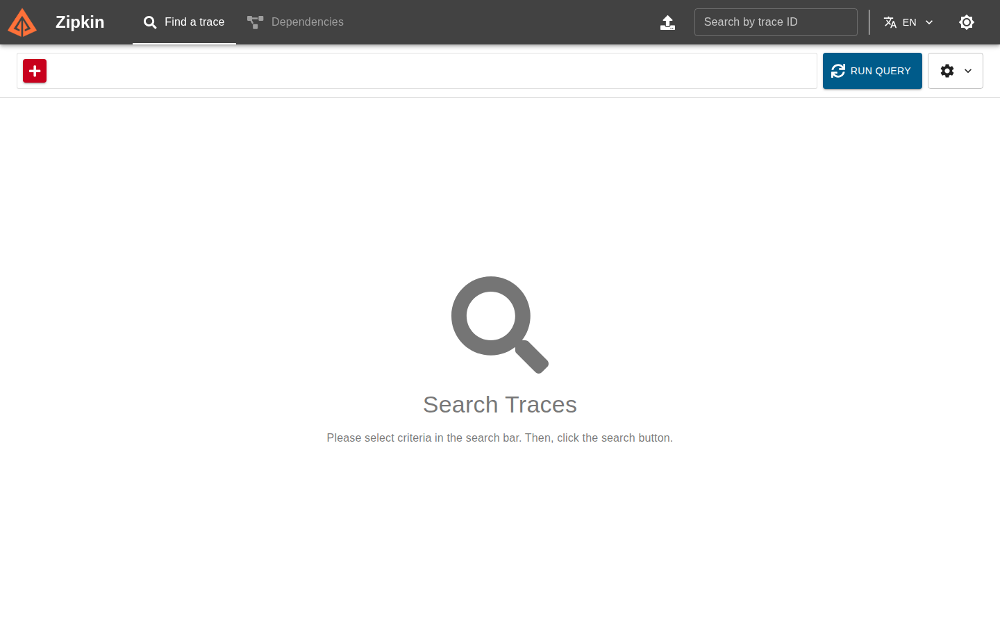

---

**Prometheus (http://localhost:9091)**

Prometheus was running and collecting metrics from all services via Spring Boot Actuator endpoints.

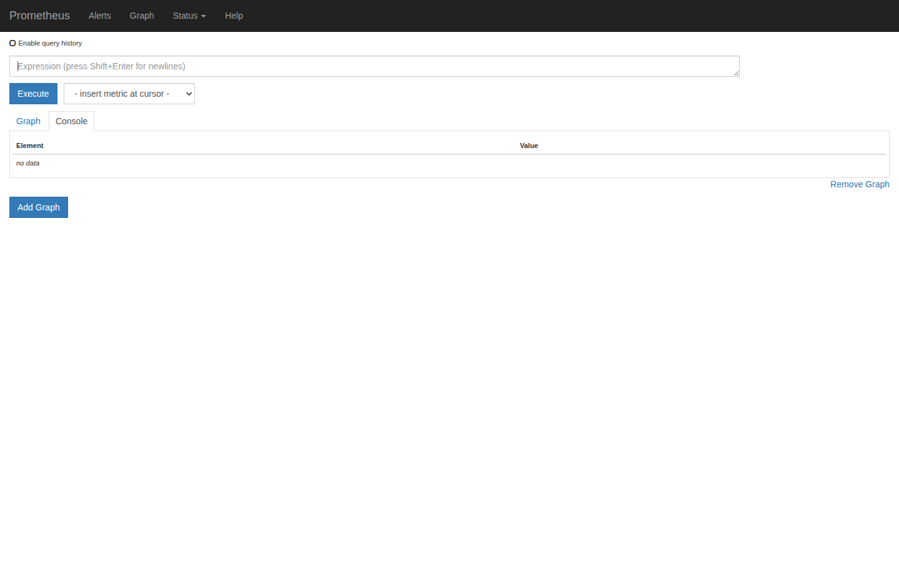

---

**Grafana (http://localhost:3030)**

Grafana was running with the pre-configured Spring PetClinic datasource and dashboard ready to use.

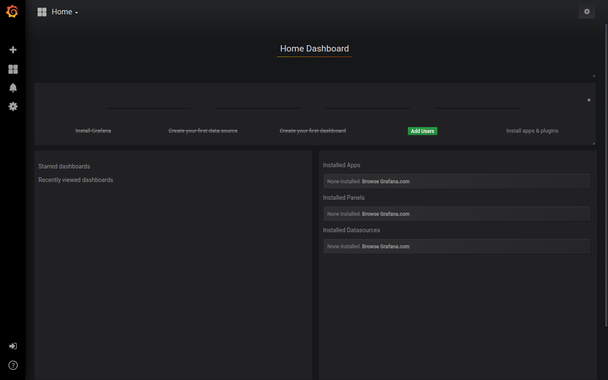

---

### Step 5 — Test Application Functionality

**Owners List**

The Find Owners page returned all 10 seeded owners with their addresses, cities, phone numbers, and pets — confirming `customers-service` was serving data correctly through `api-gateway`.

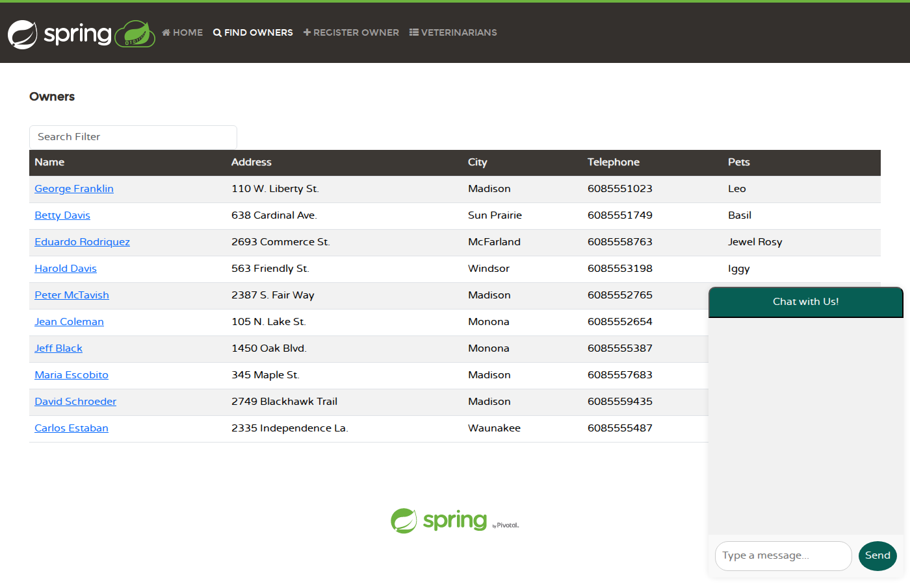

---

**Owner Detail and Pet Visit History**

Navigating to George Franklin's profile showed his pet Leo (a cat born 7 September 2010) with the option to add a new visit — confirming cross-service routing from `api-gateway` to `customers-service`.

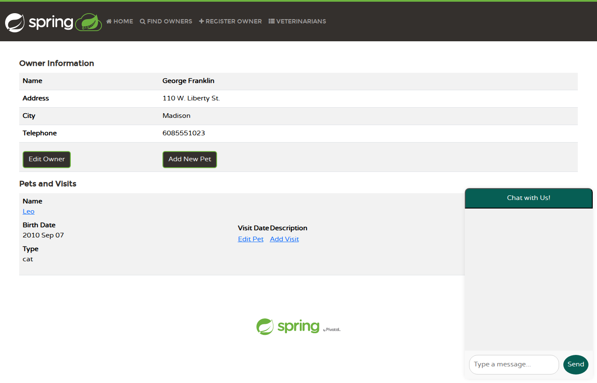

---

**Add Visit — Submitted Successfully**

A new visit ("Annual check-up") was submitted for Leo on 17 June 2026. The page refreshed and displayed the visit record, confirming `visits-service` wrote to and read from its in-memory database via `api-gateway`.

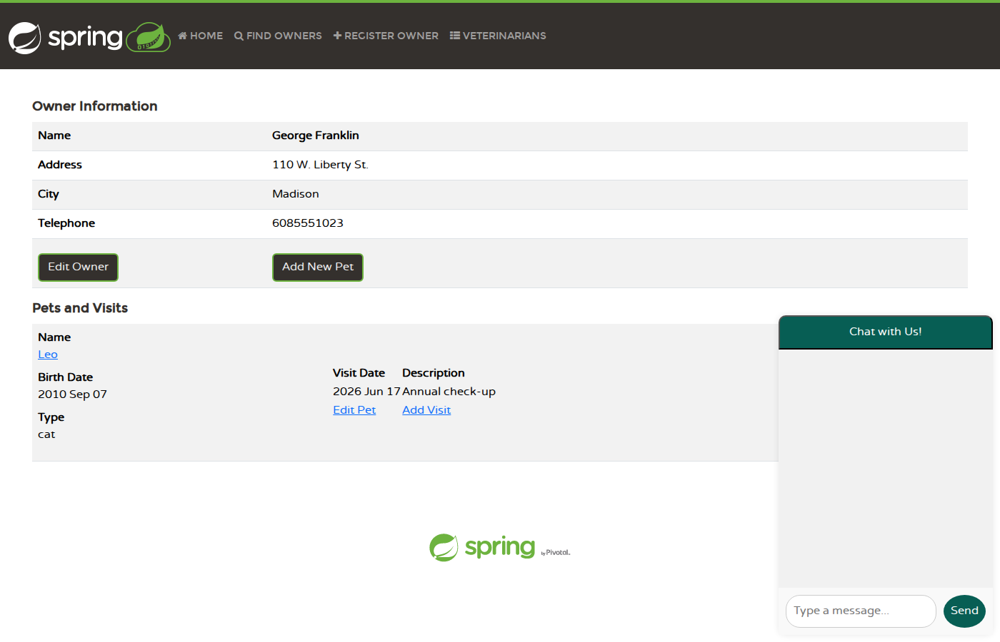

---

**Veterinarians List**

The Veterinarians page listed all 6 vets with their specialties, confirming `vets-service` was returning data correctly.

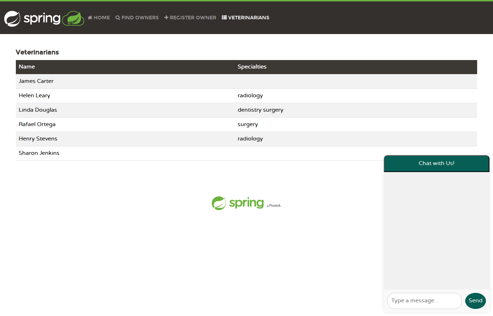

---

### Step 6 — Verify Monitoring

**Prometheus — Live Metrics Query**

Querying `http_server_requests_seconds_count` in Prometheus returned a full result set of metrics from all instrumented services, confirming Prometheus was actively scraping application metrics.

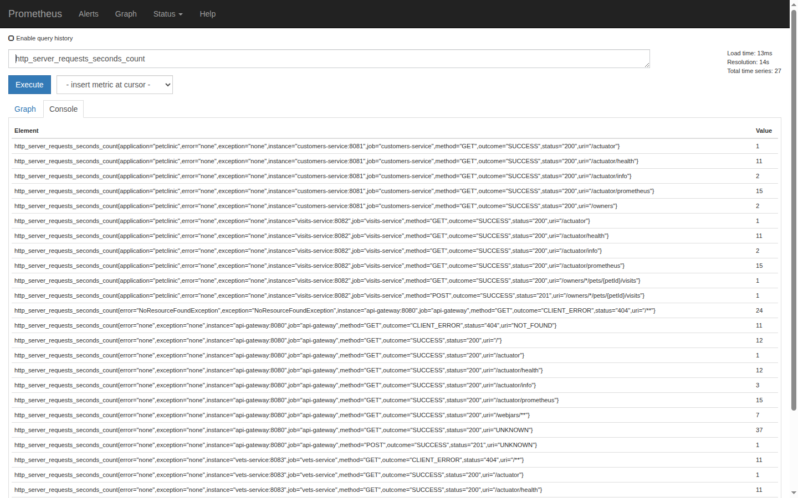

---

**Grafana — Spring PetClinic Metrics Dashboard**

The Spring PetClinic Metrics dashboard in Grafana showed live data:
- **HTTP Request Latency:** avg 9ms, max 121ms
- **HTTP Request Activity:** 0.33 ops/s with 0 errors

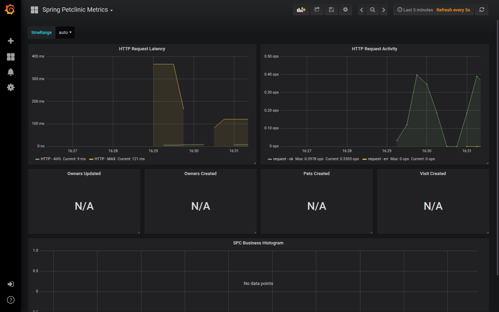

---

**Zipkin — Distributed Trace**

A full distributed trace was captured for a `GET /api/customer/owners` request:
- **Total duration:** 23.942ms
- **Services involved:** 3 (`api-gateway`, `customers-service`, `public` DB)
- **Total spans:** 26
- **Outcome:** SUCCESS (HTTP 200)

The trace showed the complete request chain: `api-gateway` → `customers-service` → database queries, with all spans completing successfully.

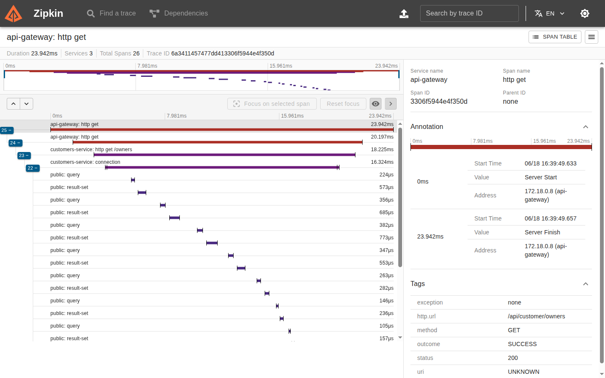

---

## CI Workflow

The GitHub Actions workflow [Local Deployment — Docker Compose](.github/workflows/docker-compose-deployment.yml) automates the same deployment on every push to `main`. It runs `docker compose up -d`, waits for all services to become healthy, verifies every endpoint, prints `docker compose ps`, and tears down cleanly.

---

## Repository Structure

```
.
├── docker-compose.yml              # Main service definitions
├── docker-compose.override.yml     # Zipkin tracing endpoint overrides
├── docker/
│   ├── prometheus/                 # Prometheus configuration and Dockerfile
│   └── grafana/                    # Grafana configuration, dashboards, and Dockerfile
├── evidence/                       # Screenshots of the full local deployment
├── spring-petclinic-*/             # Source code for each microservice
└── .github/workflows/
    └── docker-compose-deployment.yml
```
